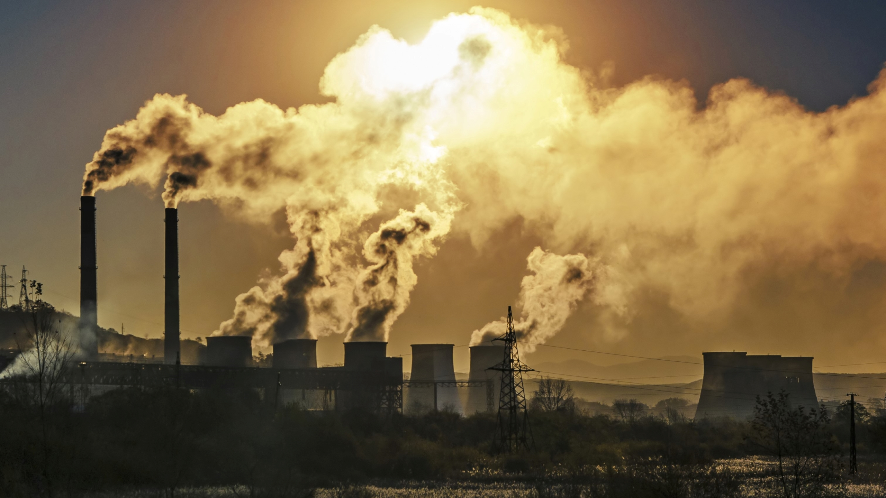
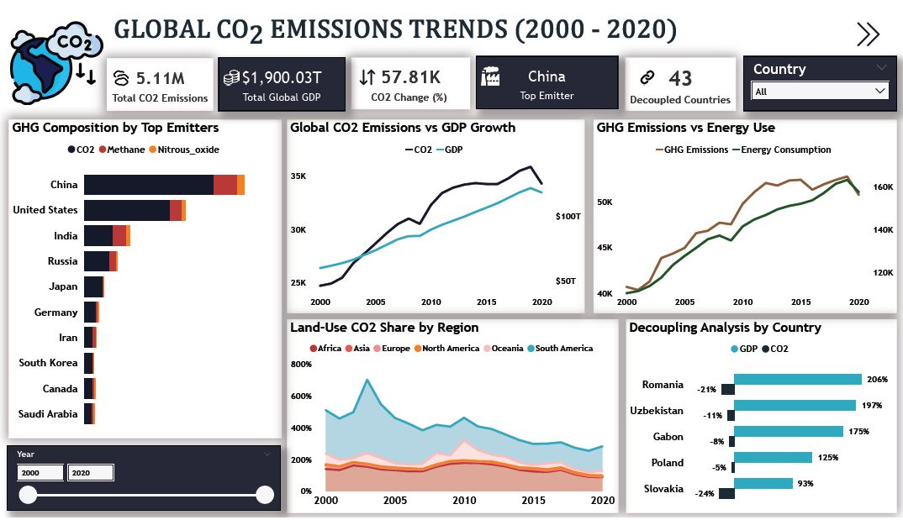

<<<<<<< HEAD
#   

# Overview
>This project analyses world carbon emissions trends by focusing on sovereign countries, excluding micro-territories and regional aggregates to ensure data accuracy and consistency.
## Objective
To visualize trends, distribution, and patterns in global greenhouse gas emissions (CO2, CH4, N2O), comparing countries, per captia impacts, and energy usage from 2000 to 2020.
## Research Question
1.	How have global CO2 emissions evolved between 2000 and 2020? (Emission Trend)
2.	Which countries had the highest CO2 emissions in 2020? (Top emitters)
3.	What is the relationship between GDP and CO2 emissions over time? (GDP-emissions correlation)
4.	How do CO2, methane, and nitrous oxide emissions compare across top emitting countries in 2020? (GHG Comparison)
5.	How has primary energy consumption impacted greenhouse gas emissions? (Energy efficiency)
6.	Which countries show a decoupling trend between CO2 emissions and economic growth? (Decoupling)
7.	How has land use change CO2 contributed to total emissions in different regions?
## Dataset
**Data Source:** [Our World in Data – CO2 and GHG dataset] (https://ourworldindata.org/)

**Time Range:** 2000 – 2020

The original dataset consists of 25 columns and 6120 rows.

 Metadata below:
- **country** – Name of the country.  
- **year** – Year of observation.  
- **iso_code** – ISO 3-letter country code.  
- **population** – Total population of the country in the given year.  
- **gdp** – Gross Domestic Product (in USD) for the country.  
- **co2** – Total CO₂ emissions from fossil fuels (in million tonnes).  
- **co2_including_luc** – CO₂ emissions including land-use change.  
- **co2_per_capita** – CO₂ emissions per person.  
- **co2_per_gdp** – CO₂ emissions per unit of GDP.  
- **coal_co2** – CO₂ emissions from coal.  
- **coal_co2_per_capita** – Coal-related CO₂ per person.  
- **consumption_co2** – CO₂ emissions from consumption-based accounting.  
- **cumulative_co2** – Total historical CO₂ emissions up to the given year.  
- **gas_co2** – CO₂ emissions from natural gas.  
- **gas_co2_per_capita** – Gas-related CO₂ per person.  
- **land_use_change_co2** – CO₂ emissions from land-use changes like deforestation.  
- **methane** – Total methane (CH₄) emissions.  
- **methane_per_capita** – Methane emissions per person.  
- **nitrous_oxide** – Total nitrous oxide (N₂O) emissions.  
- **nitrous_oxide_per_capita** – Nitrous oxide emissions per person.  
- **oil_co2** – CO₂ emissions from oil.  
- **oil_co2_per_capita** – Oil-related CO₂ per person.  
- **primary_energy_consumption** – Total primary energy consumption.  
- **total_ghg** – Total greenhouse gas emissions (CO₂, CH₄, N₂O, etc.).  
- **trade_co2** – CO₂ emissions embedded in trade.

### Methodology
This project follows a structured approach to analyze global greenhouse gas emissions:
1. **Data Collection**  
   - Sourced country-level emissions data from publicly available datasets (Our World in Data).
   - Selected key variables including CO₂, CH₄, N₂O, GDP, population, energy consumption, and land-use change emissions.
2. **Data Cleaning & Preparation**  
     - Used **SQL** to clean raw datasets, handle missing values, and standardize country names and ISO codes.  
   - Created tables directly in SQL.
3. **Analysis & Visualization**  
     - Linked SQL tables to **Power BI** to build interactive dashboards.  
   - Visualized trends, regional comparisons, and emissions by source.  
   - Explored decoupling of emissions from economic growth and other key patterns. 
4. **Insights & Interpretation**  
   - Identified countries with decreasing emissions relative to GDP growth.  
   - Highlighted regions with significant land-use change contributions.  
   - Examined patterns in energy-related emissions and trade-related CO₂.  
5. **Tools & Technologies**  
   - **SQL** for data querying and preparation  
   - **Power BI** for dashboards and visualizations

## Data Visualization
The insights from this project are presented through an interactive Power BI dashboard designed to highlight key patterns in CO₂ emissions, GDP growth, greenhouse gas contributions, and decoupling trends.

Below is the snapshot of the dashboard:

Access the **full project files**:
[Download here](https://drive.google.com/drive/folders/1E9HeWAdfjxZZuJxdUabkKhqrEftt-6Gb?usp=sharing)

## Key Insights
1.	China remains the top emitter over two decades. CO₂ dominates the GHG mix for top emitters; CH₄ and N₂O are important in agriculture-heavy countries.
2.	CO₂ emissions grew by 57.81% from 2000 to 2020, with a slight slowdown around the 2020 COVID period.
3.	Energy use drives emissions. A close positive relationship exists between energy consumption and GHG emissions.
4.	South America records the highest land-use change CO₂ emissions, which are commonly linked to deforestation and land disturbance such as forest fires.
5.	43 countries show decoupling. Many countries increase GDP while keeping emissions stable or growing more slowly.
6.	Notable decouplers (Romania, Uzbekistan, Gabon, Poland, Slovakia) show strong GDP growth with much smaller CO₂ increases; useful case studies.
7.	2020 is an anomaly due to COVID-19. The dip around 2020 reflects pandemic-related economic slowdowns and temporary emissions reductions, short-term changes around that year should be interpreted with caution.
## Conclusion
This analysis highlights key global emission patterns from 2000 to 2020, showing a 57.81% rise in CO₂ alongside steady economic growth. While emissions remain high overall, 43 countries demonstrate evidence of decoupling, and regional differences especially in land-use change and energy consumption reveal the varied drivers of greenhouse gases worldwide. These insights provide a clear foundation for understanding progress, challenges, and future actions needed to address global emissions.
## Recommendations
1.	**Scale Clean Energy Adoption:** Expanding renewable energy and improving energy efficiency will help reduce emissions tied to rising energy demand.
2.	**Address Land-Use Change Emissions:** Regions with high land-use CO₂ should prioritize sustainable land management, anti-deforestation efforts and real-time monitoring of forests.
3.	**Support Countries in Transition:** Emerging economies need targeted support such as technology, financing, and capacity-building to grow sustainably.
4.	**Sustain Decoupling Momentum:** Countries already showing decoupling should reinforce low-carbon policies to maintain long-term progress.